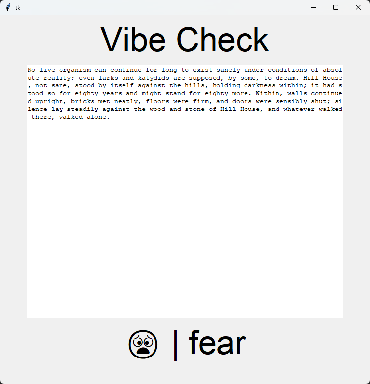

# VibeCheckGUI
##### *A simple machine learning model for analyzing the emotionality of text with ~87% accuracy.*

## Emotional Categories
sadness, joy, love, anger, fear, surprise

## Screenshot

## Usage
Type a prompt into the textbox and the model will analyze it live. 
###### *Note: the accuracy tends to improve as you type more words.*

## Credit

### Vibe.py Implementation
>Author: Ellie Moore

### Training Data Used
>https://www.kaggle.com/datasets/bhavikjikadara/emotions-dataset
>Author: Bhavik Jikadara
>License: https://creativecommons.org/licenses/by/4.0/
>Changes Made: None

### References
>https://web.stanford.edu/~jurafsky/slp3/4.pdf
>Authors: Daniel Jurafsky & James H. Martin
